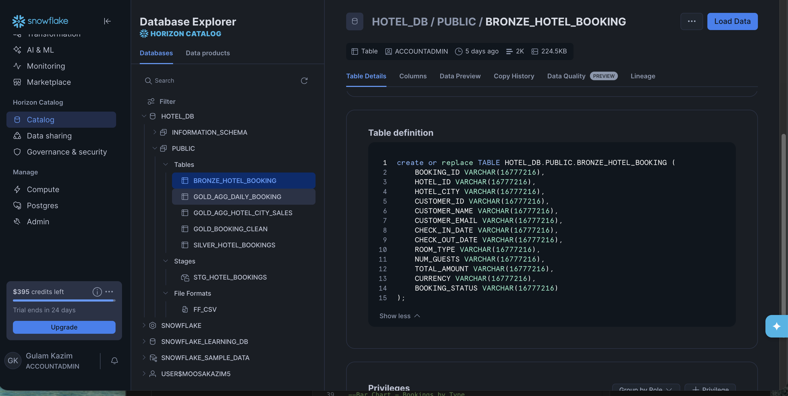
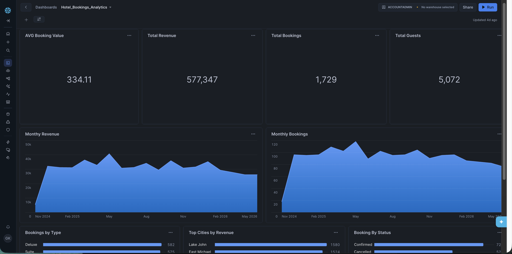
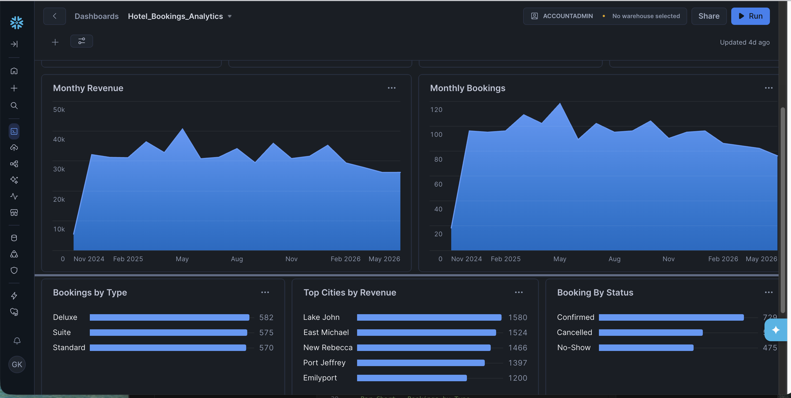

# hotel-booking-data-engineering-snowflake
❄️ This project demonstrates an end-to-end data engineering pipeline built entirely within the Snowflake Data Cloud. It transforms raw, inconsistent hotel booking data into a clean, actionable analytics dashboard without the need for external ETL tools or Python.

📂 Dataset Description
The dataset used in this project consists of hotel booking records containing raw, unformatted information. It includes a mix of categorical, numerical, and date-based data that required significant cleaning to be useful for analysis.

🏗️ Architecture: Medallion Framework
The project follows the industry-standard Medallion Architecture to ensure data quality:

1) Bronze (Raw): Ingestion of raw CSV data from Snowflake Stages using custom File Formats. Data is kept in its original state to maintain a "source of truth."

2) Silver (Cleaned): Application of data quality rules using Snowflake SQL.

Standardized text formatting (Initcap/Trim).

Handled null values and invalid email formats.

Fixed data anomalies (e.g., negative revenue values and logical date errors where checkout preceded check-in).

3) Gold (Curated): Business-level aggregates optimized for reporting. Tables are structured to provide insights into monthly revenue trends, city performance, and booking status distribution.

🛠️ Tech Stack & Features
Platform: Snowflake

Language: Snowflake SQL

Data Loading: Internal Stages & COPY INTO commands.

Data Transformation: Complex SQL transformations, Case logic, and Aggregate functions.

📊 Analytics Dashboard (Snowsight):

Key Performance Indicators (Total Revenue, Total Bookings, Average Booking Value,Top 5 Revenue-Generating Cities,Monthly Booking & Revenue Trends,Booking Analysis by Room Type and Status.)

🚀 Key Insights
By utilizing a Snowflake-native approach, this project achieves a simplified architecture that reduces data movement and lowers cost-to-serve by keeping all processing within the cloud data warehouse.

👤 Author

Gulam Kazim Master’s in Computational Science Data Engineer | Data Analyst

LinkedIn: https://www.linkedin.com/in/gmmk-5bba5125b
